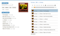
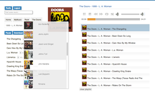
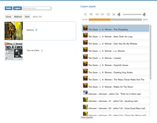
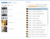
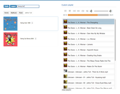

Description
===========

A simple mp3, ogg and m4a streaming app with radio mode and playlists. It is built using PHP, HTML, CSS 
and JavaScript (jQuery).

In radio mode a random playlist will be generated and as each song finishes it's popped off the list and a new
song is pushed onto the end.

See screenshots for various views.

Screenshots
===========

  

  

Features
========

* Supports mp3, ogg and m4a using jplayer.
* ID3 support. Currently id3v2, but more to follow.
* Interface is fully JavaScript/Ajax powered.
* Playlists
* Infinite random playlist in radio mode. List may be filtered.
* Album art is manually managed. ID3 support to be implemented.
* Folder montages of cover art for top level folders.
* No database, but could easily be supported in the future.
* Mobile support. Chrome for iOS is supported when screen locked.
* Keyboard shortcuts: Up/Down for Volume, Left/Right for Track Advancement, Space for Play/Pause, Backspace for Mute.

License
=======

See [Apache 2 license](https://www.apache.org/licenses/LICENSE-2.0.html), [`LICENSE.md`](LICENSE.md).

Dependencies
============

* PHP 5.3+
* Webserver with PHP support. Apache2 recommended.
* Flash or HTML5 capable web browser.
* UNIX tools. These are required to build search and radio indexes as well as cover art. These portions of the application are managed from the command line. In the future they may move into the application.
    * `mogrify` and `montage` from ImageMagick
    * `find`
    * Command line `php`
    * `coverlovin.py` if you want to find album art automatically.

Setup
=====

See [`INSTALL.md`](INSTALL.md)

Todo
====

* Browser history.
* Manage music from web.
* Manage configuration from web.
* More playlist functionality.
